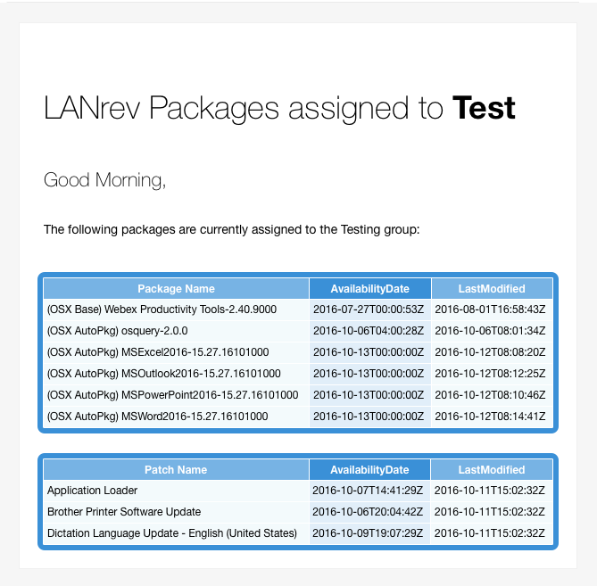

# LANrevNotifier

### NOTE: You need to manually run the script once in order to set the default Test group value.

**LANrevNotifier** will run once a day (by default) via a LaunchDaemon (included). It currently is set to run once every day at 7AM, but this can be changed in the `com.github.jbaker10.LANrevNotifier.plist`.

When the script is run, if there are no packages or patches assigned your designated Test group, it will just exit out. Otherwise, you will recieve an email like so:

